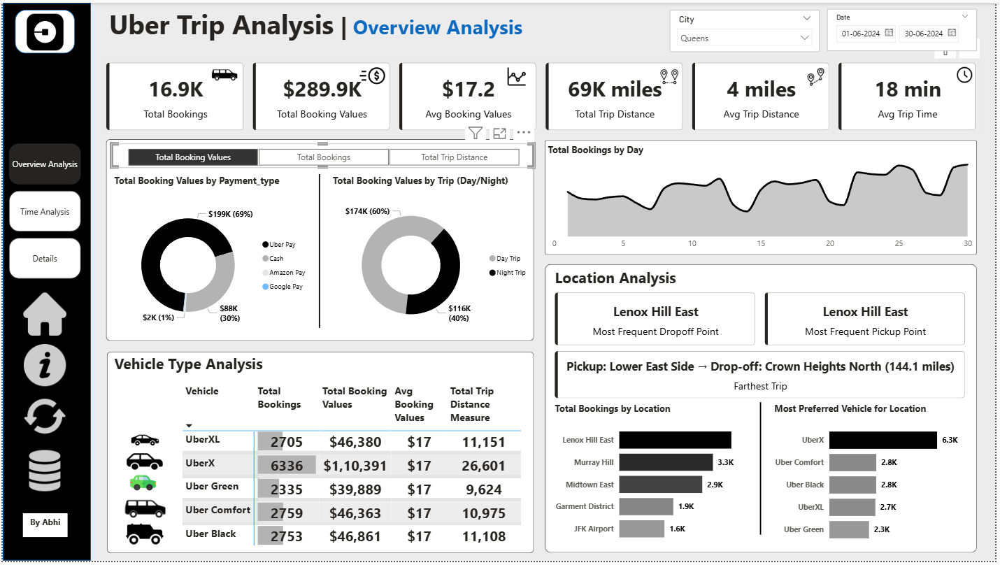
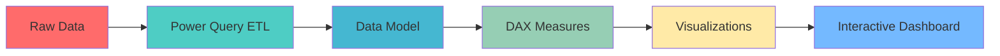

<div align="center">


<br/>

[](https://powerbi.microsoft.com/)
[](https://www.microsoft.com/excel)
[](https://dax.guide/)
[](https://opensource.org/licenses/MIT)

<h3>🚖 Real-Time Data Analysis | 📊 Interactive Visualizations | 💰 Revenue Insights</h3>

**[📂 View Project](#-project-overview) • [🎯 Features](#-what-makes-this-special) • [🚀 Get Started](#-quick-start) • [📸 Gallery](#-dashboard-gallery)**

</div>

<br/>


## 📌 Project Overview


This repository showcases a **comprehensive Uber trip data analysis** built entirely in **Microsoft Power BI**. The project transforms raw transportation data into stunning, actionable insights through interactive dashboards and advanced DAX calculations.

### 🎓 Learning Journey

> **Note**: This project was built for educational purposes. I learned and developed this dashboard by following a "Watch and Make" YouTube tutorial on real-time data analysis, applying best practices in business intelligence and data visualization.

### 🎯 Problem Statement

Urban mobility companies generate massive amounts of data daily. This project addresses:
- Understanding trip patterns and peak demand hours
- Identifying high-revenue zones and vehicle performance
- Optimizing fleet allocation based on geospatial insights
- Tracking operational KPIs in real-time

<br clear="right"/>


## ✨ What Makes This Special?

<div align="center">

| 🗺️ **Geospatial Analysis** | 💰 **Revenue Intelligence** | ⚡ **Real-Time KPIs** | 📈 **Trend Analysis** |
|:---:|:---:|:---:|:---:|
| Interactive maps showing pickup/dropoff hotspots | Revenue breakdown by vehicle type & time | Live tracking of trips, fares & distances | Historical patterns & forecasting |

</div>

### 🔥 Key Features

```diff
+ Interactive Dashboard with drill-down capabilities
+ Geospatial Intelligence for demand zone identification
+ Revenue Analysis by vehicle type (SUV, Sedan, etc.)
+ Operational KPIs: Total Trips, Wait Times, Trip Duration
+ Time-based Analysis: Peak hours, daily/weekly trends
+ Location Performance: Top pickup/dropoff locations
+ Professional UI/UX with custom visuals and icons
```


## 📸 Dashboard Gallery

<div align="center">

<table>
<tr>
<td width="50%">

<h4>📊 Trip Analysis View</h4>
<p>Comprehensive breakdown of trip metrics, distances, and durations with interactive filters</p>
</td>
<td width="50%">

<h4>💵 Revenue Dashboard</h4>
<p>Financial insights with fare analysis, earnings per mile, and payment method distribution</p>
</td>
</tr>
<tr>
<td colspan="2">

<h4>🗺️ Geospatial Intelligence</h4>
<p>Map-based visualization showing demand hotspots and route optimization opportunities</p>
</td>
</tr>
</table>

</div>


## 🛠️ Technical Architecture

<div align="center">



</div>

### 📁 Repository Structure

```plaintext
Real-Time-Power-BI-Project/
│
├── 📊 ok.pbix                          # Main Power BI Report
├── 📂 data/
│   ├── Uber Trip Details.xlsx         # Trip transactions data
│   └── Location Table.xlsx            # Geospatial reference
├── 🎨 Images/                          # Dashboard icons & assets
├── 📸 deshbord_images/                 # Screenshots for docs
├── 📄 documentation/
│   ├── Problem Statement.docx
│   └── Real Time Power BI Project.docx
├── 📝 README.md
└── 📜 LICENSE
```

### 🧮 DAX Measures Implemented

<details>
<summary>Click to expand DAX examples</summary>

- **Total Trips**: `COUNTROWS(Trips)`
- **Total Revenue**: `SUM(Trips[Fare_Amount])`
- **Average Trip Distance**: `AVERAGE(Trips[Trip_Distance])`
- **Revenue per Mile**: `[Total Revenue] / [Total Distance]`
- **Peak Hour Analysis**: Time intelligence functions
- **YoY Growth**: `CALCULATE([Total Trips], SAMEPERIODLASTYEAR(Calendar[Date]))`

</details>


## 🚀 Quick Start

### Prerequisites

<div align="center">


</div>

### Installation

```bash
# Clone this repository
git clone https://github.com/Abhishek-Maheshwari-778/Real-Time-Power-BI-Project.git

# Navigate to project directory
cd Real-Time-Power-BI-Project

# Open the Power BI file
start ok.pbix
```

### 🎮 Usage

1. **Open Dashboard**: Double-click `ok.pbix` in Power BI Desktop
2. **Explore Visuals**: Use slicers and filters to interact with data
3. **Refresh Data**: Update data sources if paths have changed
4. **Customize**: Modify visuals and DAX measures as needed


## 👥 Who Is This For?

<div align="center">

<table>
<tr>
<td align="center" width="25%">
<br/>
<b>Data Analysts</b><br/>
<sub>Learn Power BI best practices</sub>
</td>
<td align="center" width="25%">
<br/>
<b>Business Managers</b><br/>
<sub>Make data-driven decisions</sub>
</td>
<td align="center" width="25%">
<br/>
<b>Students</b><br/>
<sub>Portfolio project reference</sub>
</td>
<td align="center" width="25%">
<br/>
<b>BI Developers</b><br/>
<sub>Explore DAX techniques</sub>
</td>
</tr>
</table>

</div>


## 📚 Learning Resources

<div align="center">

[](https://docs.microsoft.com/power-bi/)
[](https://dax.guide/)
[](https://community.powerbi.com/)

</div>

### 📺 Tutorial Credits

This project was built following a comprehensive YouTube tutorial series on real-time Power BI analytics. Special thanks to the creator for the excellent educational content!


## 🤝 Contributing

Contributions, issues, and feature requests are welcome!

<div align="center">

[](http://makeapullrequest.com)
[](https://github.com/Abhishek-Maheshwari-778/Real-Time-Power-BI-Project/graphs/contributors)

</div>

### How to Contribute

1. 🍴 Fork the repository
2. 🔨 Create your feature branch (`git checkout -b feature/AmazingFeature`)
3. 💾 Commit your changes (`git commit -m 'Add some AmazingFeature'`)
4. 📤 Push to the branch (`git push origin feature/AmazingFeature`)
5. 🎉 Open a Pull Request


## 📄 License

This project is licensed under the **MIT License** - see the [LICENSE](LICENSE) file for details.


<div align="center">

## 👨‍💻 Author


<br/>

**Abhishek Maheshwari**  
*Data Scientist | Analyst*

A passionate developer focused on creating tools that help the community build better, more beautiful software.

<br/>

[](https://github.com/Abhishek-Maheshwari-778)
[](https://abhishek-maheshwari-778.github.io/Ultimate_GitHub_Profile_Collection_website/)

<br/>

### ⭐ Support This Project

If you find this analysis useful or inspiring, please give it a **star**!  
It helps me create more open-source content.

[](https://github.com/Abhishek-Maheshwari-778/Real-Time-Power-BI-Project)

<br/>

**Made with 💜 by Abhishek Maheshwari**

<br/>


</div>
