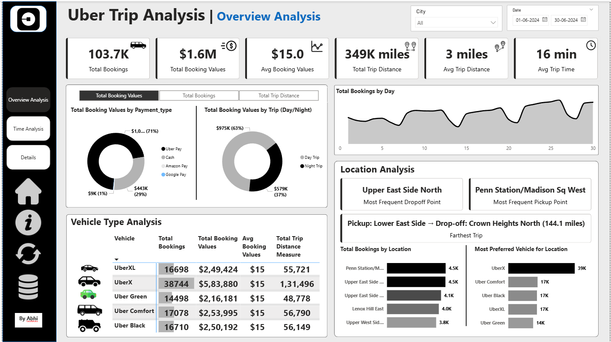
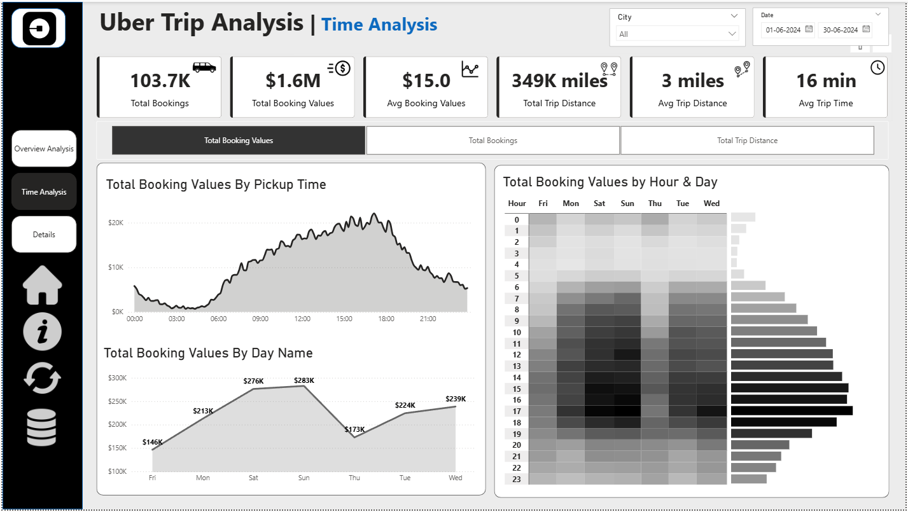
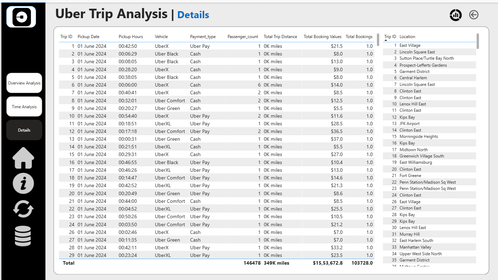

<div align="center">

# Real-Time Power BI Project: Uber Analysis

### Data-Driven Insights into Urban Mobility



---

**[View Dashboard](#dashboard-highlights)** • **[Explore Features](#key-features)** • **[Tech Stack](#technical-architecture)** • **[Get Started](#getting-started)**

</div>

---

## Project Overview

This repository hosts a comprehensive **Uber Data Analysis** project built with **Microsoft Power BI**. Designed for data analysts, business intelligence professionals, and urban planners, this dashboard transforms raw trip data into actionable insights.

It solves the challenge of understanding complex trip patterns by visualizing key metrics like pickup/drop-off densities, trip durations, and revenue generation in a sleek, interactive interface.

> **Note**: This project was built for educational purposes. I learned and developed this dashboard by following a "Watch and Make" YouTube tutorial on real-time data analysis.

---

## Dashboard Highlights

<div align="center">
  <table>
    <tr>
      <td width="50%">
        
        <p align="center"><b>Trip Analysis View</b></p>
      </td>
      <td width="50%">
        
        <p align="center"><b>Revenue Breakdown</b></p>
      </td>
    </tr>
  </table>
</div>

---

## Why This Project?

Your data analysis portfolio is your digital handshake. In 5 seconds, it tells recruiters and collaborators what you can do.

This project demonstrates:
- ✅ **Real-World Application**: Working with actual business data scenarios
- ✅ **End-to-End Workflow**: From data cleaning to interactive visualization
- ✅ **Professional Design**: Clean, intuitive dashboard layout
- ✅ **Actionable Insights**: KPIs that drive business decisions

---

## Key Features

<table>
<tr>
<td width="33%" align="center">

**Interactive Dashboard**

A fully dynamic `.pbix` report allowing deep-dives into specific timeframes and locations

</td>
<td width="33%" align="center">

**Geospatial Intelligence**

Visual maps tracking Pick-up and Drop-off hotspots to identify high-demand zones

</td>
<td width="33%" align="center">

**Revenue Analysis**

Detailed breakdown of fares by vehicle type (SUV, Sedan) and time of day

</td>
</tr>
</table>

### Operational KPIs Tracked:
- Total Trips
- Average Wait Times
- Trip Durations
- Earnings per Mile
- Peak Hour Analysis
- Location-Based Performance

---

## Technical Architecture

The analysis is built on a robust data modeling foundation within Power BI.

```plaintext
Real-Time-Power-BI-Project/
├── data/
│   ├── Uber Trip Details.xlsx    # Raw Trip Data (Time, Fare, Distance)
│   └── Location Table.xlsx       # Geospatial Reference Data
├── assets/
│   ├── Images/                   # Icons & UI Assets
│   └── deshbord_images/          # Dashboard Screenshots
├── documentation/
│   ├── Problem Statement.docx    # Project Requirements
│   └── Real Time Power BI Project.docx
├── ok.pbix                       # Main Power BI Report File
├── README.md                     # Project Documentation
└── LICENSE                       # MIT License
```

### Data Model Features:
- Star schema design for optimal performance
- DAX measures for complex calculations
- Relationship mapping between trip and location data
- Time intelligence functions for trend analysis

---

## Getting Started

### Prerequisites
- [Microsoft Power BI Desktop](https://powerbi.microsoft.com/desktop/) (Latest Version)
- Basic understanding of data visualization concepts

### Installation Steps

1. **Clone the Repository**
   ```bash
   git clone https://github.com/Abhishek-Maheshwari-778/Real-Time-Power-BI-Project.git
   cd Real-Time-Power-BI-Project
   ```

2. **Open the Report**
   - Double-click `ok.pbix` to open in Power BI Desktop

3. **Refresh Data (Optional)**
   - If data source paths have changed, update them in Power BI
   - Go to `Transform Data` > `Data Source Settings`
   - Point to the Excel files in your local directory

4. **Explore**
   - Interact with filters and slicers
   - Drill down into specific metrics
   - Export insights as needed

---

## Who Is This For?

<table>
<tr>
<td width="25%" align="center">

**Data Analysts**

Explore techniques for data cleaning, modeling, and DAX calculations

</td>
<td width="25%" align="center">

**Transport Managers**

Understand peak hours and optimize fleet allocation

</td>
<td width="25%" align="center">

**Business Owners**

Analyze revenue streams and identify growth opportunities

</td>
<td width="25%" align="center">

**Students**

Perfect reference for end-to-end Power BI project execution

</td>
</tr>
</table>

---

## Learning Resources

Want to build something similar? Here are the resources I used:

- [Power BI Documentation](https://docs.microsoft.com/power-bi/)
- YouTube Tutorial: "Real Time Power BI Project | Uber Analysis"
- [DAX Guide](https://dax.guide/)
- [Power BI Community](https://community.powerbi.com/)

---

## Contributing

Contributions are welcome! If you have suggestions for better visuals or optimized DAX measures:

1. Fork the repository
2. Create a feature branch (`git checkout -b feature/ImprovedVisuals`)
3. Commit your changes (`git commit -m 'Add clearer revenue breakdown'`)
4. Push to the branch (`git push origin feature/ImprovedVisuals`)
5. Open a Pull Request

---

## License

This project is licensed under the MIT License - see the [LICENSE](LICENSE) file for details.

---

<div align="center">

## Author

**Abhishek Maheshwari**  
*Data Scientist | Analyst*

A passionate developer focused on creating tools that help the community build better, more beautiful software.

---

### Support the Project

If you find this analysis useful or inspiring, please give it a **⭐ star**!

It helps me create more open-source content.

---

**Made with 💜 by Abhishek Maheshwari**

© 2026 Real-Time Power BI Project

</div>
